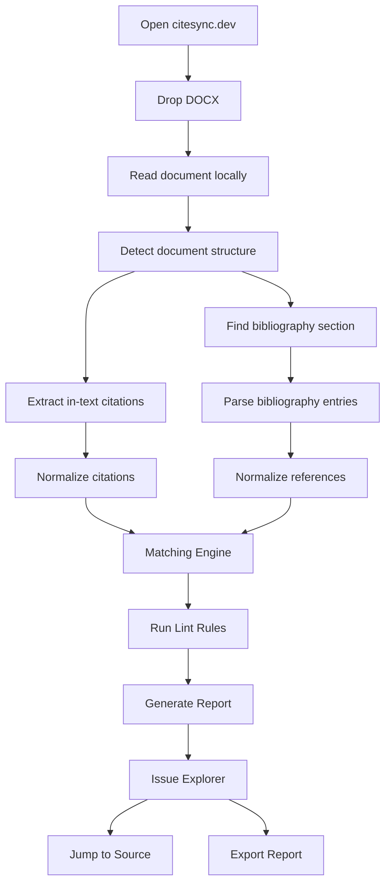
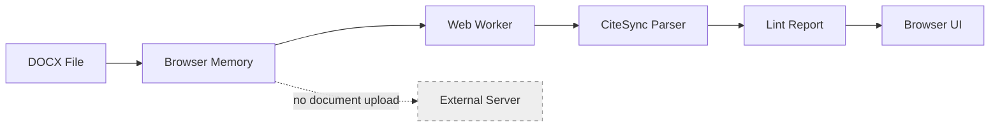
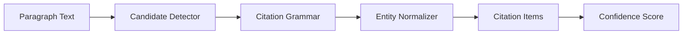
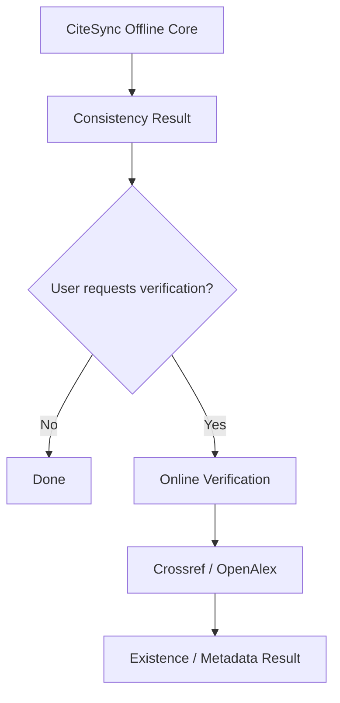
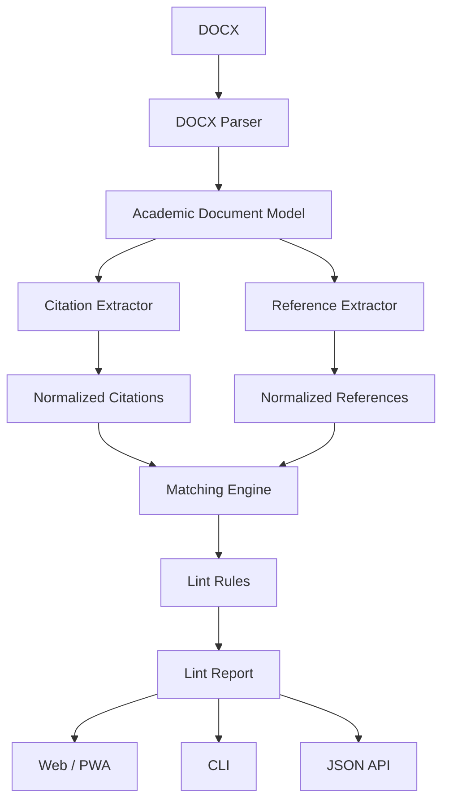
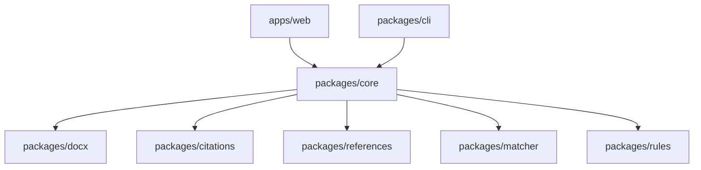

# CiteSync.dev — Product Requirements Document

**Product:** CiteSync  
**Domain:** `citesync.dev`  
**Product Type:** Open-source offline-first academic utility  
**Primary Interface:** Web/PWA  
**Secondary Interfaces:** CLI, reusable TypeScript packages  
**Status:** Product Definition v1.0  
**Primary Release:** v0.1  
**License Target:** MIT  
**Core Positioning:** Offline citation consistency checker for academic documents.

---

# 1. Product Summary

CiteSync checks whether citations inside an academic document correctly correspond to entries in the bibliography.

The product answers four primary questions:

1. Is every in-text citation represented in the bibliography?
2. Is every bibliography entry actually cited in the document?
3. Are there ambiguous or inconsistent author-year references?
4. Are numeric citations correctly mapped to bibliography entries?

The core workflow is:

```text
Document
↓
Analyze locally
↓
Extract citations
↓
Extract bibliography
↓
Match
↓
Report inconsistencies
```

Primary tagline:

> **ESLint for your citations.**

Secondary tagline:

> **Check citations before you submit. Your manuscript never leaves your device.**

---

# 2. Product Problem

Academic documents frequently contain citation consistency errors even when authors use reference managers.

Common problems include:

```text
Citation exists in text
but reference is missing.

Reference exists
but is never cited.

Citation year differs
from bibliography year.

Author-date citation matches
multiple bibliography entries.

Numeric citation points
to a missing bibliography number.

Same author has multiple
publications in one year
without a/b suffixes.
```

Manual checking becomes increasingly difficult as the document grows.

A thesis with:

```text
80 bibliography entries
120+ citation occurrences
50–100 pages
```

cannot be reliably checked by visually comparing the document with the reference list.

CiteSync automates this consistency check.

---

# 3. Product Principle

CiteSync is a **linter**, not an academic writing assistant.

The product MUST:

- produce deterministic results;
- show evidence for every issue;
- distinguish errors from uncertainty;
- keep documents private by default;
- work without accounts;
- work without an AI API;
- remain usable offline after installation/caching.

The product MUST NOT attempt to:

- write academic content;
- rewrite citations;
- generate bibliography entries;
- paraphrase text;
- detect plagiarism;
- judge research quality;
- determine whether a source supports a claim;
- automatically modify the user's manuscript.

---

# 4. Core Product Promise

User action:

```text
Drop thesis.docx
```

CiteSync returns:

```text
132 citation occurrences
87 bibliography entries
124 matched

3 errors
5 warnings
2 ambiguous matches
```

The user can inspect each issue and jump directly to its source.

---

# 5. Target Users

## Primary Users

### University Students

Use cases:

- essays;
- assignments;
- capstone reports;
- graduation theses;
- dissertations.

### Postgraduate Students

Use cases:

- master's theses;
- research reports;
- conference papers;
- dissertations.

### Researchers

Use cases:

- manuscript pre-submission checks;
- journal revision;
- reference cleanup.

---

# 6. Jobs To Be Done

## JTBD-01

> Before submitting my thesis, I want to know whether I cited references that are missing from my bibliography.

## JTBD-02

> Before submitting my paper, I want to know whether my bibliography contains references I never cited.

## JTBD-03

> I want to catch author/year mistakes without manually comparing dozens of citations.

## JTBD-04

> I want to check my manuscript without uploading unpublished research to a third-party server.

---

# 7. Core Scope

The v0.1 product supports:

```text
DOCX
↓
Citation extraction
↓
Bibliography extraction
↓
Matching
↓
Lint report
```

Supported citation families:

```text
Author-date
Numeric
```

Initial styles:

```text
APA-like
Harvard-like
IEEE-like
Vancouver-like
```

CiteSync does not attempt to perfectly validate every formatting requirement of APA, Harvard, IEEE, or Vancouver.

It validates **citation-reference consistency**.

---

# 8. Non-Goals

The following are explicitly OUT OF SCOPE for v0.1:

```text
PDF support
Google Docs extension
Microsoft Word plugin
reference existence verification
DOI lookup
Crossref integration
OpenAlex integration
LLM parsing
AI writing
plagiarism detection
grammar checking
citation style formatting
bibliography generation
automatic document editing
user accounts
cloud storage
collaboration
document history
```

---

# 9. Primary User Flow



---

# 10. Privacy Architecture

The primary web application MUST process documents locally.

Architecture:



Core privacy guarantees:

```text
No document upload
No manuscript storage
No account
No cloud database
No text analytics
No citation content telemetry
```

Analytics MAY collect anonymous product metrics such as:

```text
application opened
analysis started
analysis completed
parser version
document size bucket
processing duration
issue count bucket
```

Analytics MUST NOT include:

```text
document text
citation text
author names
reference titles
file names
bibliography contents
```

---

# 11. Offline-First Requirement

CiteSync MUST function offline after the web application has been installed or cached.

PWA capabilities:

```text
Install app
Open without network
Analyze DOCX
Review report
Export report
```

The core parser MUST NOT depend on remote resources.

---

# 12. Input Requirements

## V0.1 Supported

```text
.docx
```

Recommended maximum initial document size:

```text
50 MB
```

Large documents MUST be processed inside a Web Worker.

The UI MUST remain responsive during analysis.

---

# 13. Unsupported Inputs

v0.1 does not support:

```text
.doc
.pdf
.odt
.pages
.tex
Google Docs links
scanned documents
images
```

The application MUST clearly explain unsupported formats.

---

# 14. DOCX Processing

DOCX files MUST be parsed as OOXML packages.

Required sources:

```text
word/document.xml
word/styles.xml
word/footnotes.xml
word/endnotes.xml
word/_rels/*
```

If available:

```text
customXml
embedded citation fields
Zotero metadata
Mendeley metadata
```

must be preserved for structured citation detection.

---

# 15. Internal Document Model

All supported input formats MUST eventually map into a common representation.

```ts
interface AcademicDocument {
  metadata: DocumentMetadata;

  blocks: DocumentBlock[];

  bibliography?: BibliographySection;

  citations: CitationOccurrence[];

  sourceMap: SourceMap;
}
```

Block:

```ts
interface DocumentBlock {
  id: string;

  type:
    | "paragraph"
    | "heading"
    | "list"
    | "table"
    | "footnote"
    | "endnote";

  text: string;

  style?: string;

  source: SourceLocation;
}
```

---

# 16. Source Mapping

Every extracted citation and reference MUST retain its original location.

Example:

```ts
interface SourceLocation {
  blockId: string;
  paragraphIndex?: number;
  runIndex?: number;
  startOffset?: number;
  endOffset?: number;
}
```

This enables:

```text
click issue
↓
jump to citation
↓
highlight exact text
```

Evidence traceability is mandatory.

---

# 17. Bibliography Detection

CiteSync MUST detect common bibliography headings.

Examples:

```text
References
Reference
Bibliography
Works Cited
Literature Cited
Tài liệu tham khảo
Danh mục tài liệu tham khảo
```

Detection signals include:

```text
heading text
heading style
document position
following paragraph patterns
reference-like structure
```

Bibliography detection MUST return confidence.

Example:

```json
{
  "heading": "Tài liệu tham khảo",
  "confidence": 0.98
}
```

If bibliography detection confidence is insufficient:

```text
CiteSync must ask the user
to select the bibliography section.
```

It MUST NOT silently guess.

---

# 18. Citation Families

## Author-Date

Examples:

```text
(Smith, 2024)

Smith (2024)

(Smith & Brown, 2023)

(Smith et al., 2022)

(Smith, 2020, 2022)

(Smith, 2021a)

(Smith, 2021a, 2021b)

(Nguyen, Tran, & Le, 2024)
```

---

# 19. Numeric Citations

Examples:

```text
[1]

[1, 2]

[1–4]

[1], [3], [7]

[12-15]

¹
```

Initial v0.1 support prioritizes bracketed numeric citations.

Superscript numeric citations may be added after the core implementation stabilizes.

---

# 20. Citation Data Model

```ts
interface CitationOccurrence {
  id: string;

  raw: string;

  family: "author-date" | "numeric";

  items: CitationItem[];

  source: SourceLocation;

  confidence: number;
}
```

Author-date item:

```ts
interface AuthorDateCitationItem {
  firstAuthor?: string;

  authors?: string[];

  year?: number;

  yearSuffix?: string;

  page?: string;
}
```

Numeric item:

```ts
interface NumericCitationItem {
  numbers: number[];
}
```

---

# 21. Bibliography Entry Model

```ts
interface ReferenceEntry {
  id: string;

  raw: string;

  index?: number;

  authors?: PersonName[];

  year?: number;

  yearSuffix?: string;

  title?: string;

  containerTitle?: string;

  doi?: string;

  identifiers?: Record<string, string>;

  source: SourceLocation;

  parseConfidence: number;
}
```

---

# 22. Structured Citation Detection

Structured citation metadata MUST be prioritized over text heuristics.

Detection order:

```text
1. Embedded citation metadata
2. DOCX fields
3. Reference-manager fields
4. Plain-text parsing
```

Potential structured sources:

```text
Zotero
Mendeley
Word citation fields
CSL metadata
```

If structured citation metadata exists:

```text
structured metadata becomes
the source of truth
for citation identity.
```

Visible text remains the source for display.

---

# 23. Plain-Text Citation Parsing

When structured metadata is unavailable, CiteSync parses citation text.

Pipeline:



---

# 24. Author Normalization

Normalization MUST include:

```text
case folding
Unicode normalization
punctuation removal
whitespace normalization
initial normalization
diacritic-aware comparison
```

Examples:

```text
Nguyễn
NGUYỄN
Nguyen
```

must NOT automatically be considered identical in all cases.

Diacritic-insensitive matching MAY be used as a secondary candidate signal.

It MUST NOT override exact matches.

---

# 25. Name Matching

Matching tiers:

```text
Exact surname match
Normalized surname match
Diacritic-insensitive candidate match
Initial-compatible match
Fuzzy candidate match
```

Fuzzy matches MUST produce warnings unless confidence is sufficiently high.

---

# 26. Matching Engine

Each citation item is matched against bibliography candidates.

Example:

```text
Citation:

Smith et al. (2024)
```

Possible references:

```text
Smith, J., Brown, A., Lee, K. (2024)

Smith, P., Tran, H. (2024)

Smith, J. (2023)
```

Matching score MAY combine:

```text
First author          0.40
Year                  0.35
Additional authors    0.15
Year suffix           0.05
Other metadata        0.05
```

Exact weights remain implementation details and MUST be benchmark-driven.

---

# 27. Match Results

Every citation-reference relationship has one state:

```text
MATCHED

MISSING_REFERENCE

AMBIGUOUS

POSSIBLE_MISMATCH
```

Bibliography entries also have:

```text
CITED

UNUSED

AMBIGUOUS_USAGE
```

---

# 28. Core Lint Rules

## CS001 — Missing Reference

```text
Citation exists in text.

No matching bibliography
entry exists.
```

Severity:

```text
ERROR
```

Example:

```text
Smith (2023)

No matching reference found.
```

---

# 29. CS002 — Unused Reference

```text
Bibliography entry exists.

No citation references it.
```

Severity:

```text
WARNING
```

Example:

```text
Tran, H. (2022)...

Never cited in the document.
```

---

# 30. CS003 — Year Mismatch

Example:

```text
Text:
Smith (2023)

Bibliography:
Smith, J. (2024)...
```

Severity:

```text
WARNING
```

Suggested message:

```text
Possible year mismatch.

Citation: 2023
Reference: 2024
```

---

# 31. CS004 — Ambiguous Author-Date Match

Example:

```text
Citation:

Nguyen (2023)
```

References:

```text
Nguyen, T. (2023)...
Nguyen, H. (2023)...
```

Severity:

```text
AMBIGUOUS
```

CiteSync MUST NOT automatically select one reference.

---

# 32. CS005 — Missing Year Suffix

Example:

```text
Smith (2023)
```

References:

```text
Smith, J. (2023). Article A.
Smith, J. (2023). Article B.
```

Potential issue:

```text
2023a / 2023b distinction required.
```

Severity:

```text
WARNING
```

---

# 33. CS006 — Invalid Numeric Citation

Example:

```text
Citation:
[24]

Bibliography:
ends at [21]
```

Severity:

```text
ERROR
```

---

# 34. CS007 — Missing Numeric Reference

Example:

```text
Citation range:
[14–18]
```

References:

```text
14
15
16
18
```

Output:

```text
Reference [17] is missing.
```

Severity:

```text
ERROR
```

---

# 35. CS008 — Unused Numeric Reference

Example:

```text
Reference [12]
```

never cited.

Severity:

```text
WARNING
```

---

# 36. CS009 — Duplicate Reference

Bibliography entries have sufficiently high identity similarity.

Example:

```text
Smith J. Artificial Intelligence. 2023.

Smith, John. Artificial Intelligence. 2023.
```

Severity:

```text
WARNING
```

This rule MUST be conservative.

---

# 37. CS010 — Citation Parse Failure

Example:

```text
(Smith Brown? 2023 maybe)
```

Parser detects citation-like structure but cannot parse safely.

Severity:

```text
INFO
```

The tool should expose:

```text
Potential citation could not be interpreted.
```

---

# 38. Severity Model

CiteSync uses:

```text
ERROR

WARNING

AMBIGUOUS

INFO
```

Definitions:

### ERROR

Strong evidence of an actual inconsistency.

### WARNING

Likely issue requiring review.

### AMBIGUOUS

Multiple valid interpretations exist.

### INFO

Potential pattern detected but confidence is insufficient.

---

# 39. Core Report

Top summary:

```text
CiteSync Report

Document
─────────────────────────────

Citation occurrences       132
Unique cited works          84
Bibliography entries        87
Matched works               81

Errors                       3
Warnings                     5
Ambiguous                    2
```

---

# 40. Main Results UI

Desktop layout:

```text
┌─────────────────────────────────────────────────────────────┐
│ CiteSync                                                    │
├─────────────────────┬───────────────────────────────────────┤
│                     │                                       │
│ Issues              │ Document                              │
│                     │                                       │
│ 3 Errors            │ According to Smith (2024)...          │
│ 5 Warnings          │                                       │
│ 2 Ambiguous         │ Tran (2022) argued that...            │
│                     │      ^^^^^^^^^^                       │
│ Missing             │                                       │
│ • Tran 2022         │                                       │
│                     │                                       │
│ Unused              │                                       │
│ • Brown 2019        │                                       │
│                     │                                       │
└─────────────────────┴───────────────────────────────────────┘
```

---

# 41. Issue Interaction

Clicking an issue MUST:

```text
scroll to source
highlight source
show matching evidence
show possible references
```

Example:

```text
ERROR

Tran (2022)

Citation:
Page/paragraph 42

No matching bibliography
entry found.

Possible matches:

Tran (2021) — 72%
Tran & Nguyen (2022) — 63%
```

---

# 42. Evidence Panel

Every issue MUST explain why it exists.

Example:

```text
Why CiteSync flagged this

Citation:
Smith (2023)

Closest reference:
Smith, J. (2024)

Author match:
100%

Year match:
0%

Result:
Possible year mismatch.
```

This explanation MUST come from deterministic matcher data.

It MUST NOT be generated by an LLM.

---

# 43. User Corrections

The user MAY manually resolve ambiguity inside CiteSync.

Example:

```text
Citation:
Nguyen (2023)

Matches:

○ Nguyen T. (2023)
○ Nguyen H. (2023)
```

This decision affects the current analysis session.

It MUST NOT modify the source DOCX.

---

# 44. Session State

V0.1 stores session state only locally.

Possible storage:

```text
memory
IndexedDB
```

Default:

```text
document disappears
when user clears session
```

No document persistence is required.

---

# 45. Export Report

Supported export:

```text
JSON
HTML
```

Optional:

```text
Markdown
```

Example CLI-compatible JSON:

```json
{
  "summary": {
    "citations": 132,
    "references": 87,
    "errors": 3
  },
  "issues": []
}
```

PDF report is OUT OF SCOPE for v0.1.

---

# 46. Reusable Core Package

Primary package:

```text
@citesync/core
```

Example:

```ts
import { lintDocument } from "@citesync/core";

const result = await lintDocument(document);
```

Core package MUST NOT depend on:

```text
React
Next.js
browser DOM
server runtime
UI libraries
```

---

# 47. Proposed Package Architecture

```text
citesync/

apps/
  web/

packages/
  core/
  docx/
  document-model/
  citations/
  references/
  matcher/
  rules/
  report/
  cli/

fixtures/
  author-date/
  numeric/
  zotero/
  mendeley/

benchmarks/

docs/
```

---

# 48. Package Responsibilities

## `@citesync/docx`

Responsibilities:

```text
open DOCX
parse OOXML
extract paragraphs
extract styles
extract fields
extract footnotes
extract endnotes
extract citation metadata
create source map
```

---

## `@citesync/citations`

Responsibilities:

```text
detect citation candidates
parse author-date citations
parse numeric citations
normalize citation entities
```

---

## `@citesync/references`

Responsibilities:

```text
detect bibliography
split bibliography entries
parse reference metadata
normalize references
```

---

## `@citesync/matcher`

Responsibilities:

```text
candidate generation
matching
confidence scoring
ambiguity detection
```

---

## `@citesync/rules`

Responsibilities:

```text
CS001
CS002
CS003
...
```

---

## `@citesync/report`

Responsibilities:

```text
summary
issue serialization
JSON output
HTML output
```

---

# 49. CLI

CLI MAY ship in v0.1 if effort remains small.

Usage:

```bash
npx citesync thesis.docx
```

Output:

```text
CiteSync

132 citations
87 references

3 errors
5 warnings
2 ambiguous
```

Detailed:

```bash
npx citesync thesis.docx --format detailed
```

Machine-readable:

```bash
npx citesync thesis.docx --format json
```

---

# 50. CLI Exit Codes

Recommended:

```text
0
No errors

1
Citation consistency errors found

2
Document could not be parsed

3
Unsupported document
```

This allows future CI usage.

---

# 51. Configuration

Default config:

```text
auto-detect citation family
```

Optional `.citesyncrc`:

```json
{
  "citationFamily": "author-date",
  "language": "auto",
  "rules": {
    "CS002": "warning",
    "CS009": "warning"
  }
}
```

---

# 52. Rule Extensibility

Rules MUST implement a shared interface.

```ts
interface CiteSyncRule {
  id: string;

  run(context: RuleContext): CiteSyncIssue[];
}
```

Community contributors SHOULD be able to add rules without modifying the matcher.

---

# 53. Citation Style Scope

CiteSync does NOT implement a complete citation style engine.

Style-specific differences are normalized into citation families.

Initial families:

```text
author-date
numeric
```

Future:

```text
author-only
note-based
```

---

# 54. Language Scope

V0.1 UI:

```text
English
```

Parser SHOULD work with author names and bibliography headings in:

```text
English
Vietnamese
```

Vietnamese bibliography heading support is required.

Future UI localization:

```text
Vietnamese
```

---

# 55. Performance Requirements

Target:

```text
100-page DOCX

< 3 seconds
on a typical modern laptop
```

Target interaction:

```text
Drop file
↓
report
```

without visible UI freezing.

All heavy parsing MUST run in Web Worker where applicable.

---

# 56. Browser Requirements

Priority:

```text
Chrome
Edge
Firefox
Safari
```

Desktop first.

Mobile document analysis is supported only when technically practical.

Mobile UX is secondary.

---

# 57. PWA Requirements

The web application SHOULD provide:

```text
Installable PWA
Offline shell
Cached parser
No network requirement after install
```

Offline status MUST be visible.

Example:

```text
● Processing locally
```

---

# 58. Homepage

Primary hero:

```text
ESLint for your citations.

Find missing, unused, and inconsistent
references before you submit.

[ Drop your DOCX ]

Your manuscript never leaves your device.
```

Secondary demo:

```text
Smith (2024)           ✓ Matched

Tran (2022)            ✗ Missing reference

Brown (2019)           ⚠ Never cited
```

---

# 59. Homepage Product Proof

The homepage SHOULD immediately communicate:

```text
100% local processing
No account
No upload
Open source
DOCX-first
```

Do not lead with:

```text
AI-powered
```

CiteSync v0.1 does not require AI.

---

# 60. Empty State

```text
Drop a .docx file here

or

[ Choose File ]

APA / Harvard
IEEE / Vancouver

Processed locally.
```

---

# 61. Analysis State

```text
Analyzing thesis.docx

✓ Reading document
✓ Detecting bibliography
✓ Finding citations
● Matching references
○ Running checks
```

Progress MUST reflect actual pipeline stages.

---

# 62. Success State

If zero issues:

```text
✓ Citation consistency looks good.

124 citations checked.
82 references matched.

No consistency errors found.
```

Avoid absolute claims such as:

```text
Your citations are perfect.
```

CiteSync validates only supported checks.

---

# 63. Error State

Example:

```text
We couldn't identify the bibliography.

Select the heading where your
reference list begins.

[ Select section ]
```

CiteSync should recover wherever possible instead of failing the entire document.

---

# 64. Parsing Confidence

Every parsed entity MAY expose internal confidence:

```text
0.00–1.00
```

Confidence is primarily used internally.

User-facing confidence is displayed only when useful:

```text
High confidence
Needs review
Ambiguous
```

Do not display meaningless decimal scores everywhere.

---

# 65. Deterministic-First Architecture

Core rule:

```text
Same document
+
same CiteSync version

=

same result
```

This is a product requirement.

The core engine MUST NOT use generative models.

---

# 66. AI Strategy

No LLM dependency exists in the core application.

Future experimental package MAY be introduced:

```text
@citesync/ai-parser
```

It MUST remain optional.

Potential future use:

```text
unusually malformed plain-text references
```

AI results MUST never silently override deterministic results.

---

# 67. Online Verification — Future Module

A future feature MAY add:

```text
Verify source online
```

Possible services:

```text
Crossref
OpenAlex
DOI resolver
```

Architecture:



Online verification MUST be explicitly user-triggered.

---

# 68. PDF Strategy

PDF is NOT included in v0.1.

Reason:

```text
DOCX preserves document structure.

PDF primarily preserves visual layout.
```

Supporting PDF properly would require:

```text
layout reconstruction
bibliography segmentation
citation linking
OCR fallback
```

This complexity must not delay DOCX-first launch.

---

# 69. Roadmap

## v0.1 — Citation Linter

Ship:

```text
DOCX
author-date
numeric citations
bibliography detection
missing references
unused references
year mismatch
ambiguity
numeric validation
offline PWA
local processing
HTML/JSON report
```

---

# 70. v0.2 — Structured Academic Documents

Add:

```text
better Zotero support
better Mendeley support
footnotes
endnotes
superscript numeric citations
duplicate references
more bibliography formats
CLI stabilization
```

---

# 71. v0.3 — Academic Verification

Add optional:

```text
Crossref verification
OpenAlex verification
DOI validation
reference metadata mismatch
```

Core remains offline.

---

# 72. v0.4 — Additional Formats

Potential:

```text
Markdown
LaTeX
BibTeX
RIS
ODT
```

These should reuse the same internal document model.

---

# 73. v1.0

Definition:

```text
Stable DOCX parser
Stable core API
Stable rules API
Reliable author-date matching
Reliable numeric matching
500+ public fixtures
Documented benchmarks
Web/PWA
CLI
```

PDF is not required for v1.0.

---

# 74. Benchmark Dataset

Repository MUST include reproducible fixtures.

Structure:

```text
fixtures/

author-date/
  simple/
  multiple-authors/
  et-al/
  same-author-year/
  missing/
  ambiguous/

numeric/
  simple/
  ranges/
  missing/
  unused/

documents/
  docx/
```

---

# 75. Test Case Format

Example:

```json
{
  "citation": "(Smith, 2024)",
  "references": [
    "Smith, J. (2024). Example title."
  ],
  "expected": {
    "status": "matched"
  }
}
```

---

# 76. Document Fixtures

Full DOCX fixtures MUST cover:

```text
APA-like paper
Harvard-like paper
IEEE paper
Vancouver paper
Vietnamese thesis
Zotero-generated citations
plain-text citations
mixed clean/noisy references
```

Fixtures MUST contain synthetic or appropriately licensed content.

---

# 77. Quality Metrics

Primary parser metrics:

```text
Citation detection precision
Citation detection recall

Reference segmentation precision
Reference parsing accuracy

Match precision
Match recall

False-positive issue rate
```

---

# 78. Product Quality Target

For supported clean DOCX cases:

```text
Citation detection precision:
≥ 98%

Citation detection recall:
≥ 95%

Reference matching precision:
≥ 97%
```

These are release targets, not claims until measured.

---

# 79. Critical Product Metric

Most important:

> **False-positive rate.**

A linter that reports many fake problems becomes unusable.

Product philosophy:

```text
Prefer:

"I am uncertain."

over:

"This is wrong."

when evidence is insufficient.
```

---

# 80. Open-Source Contribution Model

Good first issues SHOULD include:

```text
new bibliography heading
new citation fixture
new reference format fixture
new parser edge case
new lint rule
new language normalization
```

Contributors SHOULD be able to improve CiteSync simply by adding:

```text
input
+
expected result
```

---

# 81. Repository README

README MUST show the product immediately.

Recommended sequence:

```text
Hero GIF

One-sentence description

Try online

Install CLI

What it catches

Privacy

Supported styles

Architecture

Benchmarks

Contributing
```

---

# 82. Demo GIF

Recommended 8–12 second demo:

```text
Drop thesis.docx

↓

3 issues found

↓

Click Tran (2022)

↓

citation highlighted

↓

Missing reference
```

No narrated product tour required.

---

# 83. GitHub Positioning

Repository description:

> Offline-first citation linter for academic documents. Find missing, unused and inconsistent references locally in your browser.

Topics:

```text
citations
academic-writing
references
bibliography
research
typescript
offline-first
pwa
docx
zotero
```

---

# 84. Success Metrics

Open-source success:

```text
GitHub stars
contributors
issues
forks
npm downloads
CLI usage
external integrations
```

Product success:

```text
documents analyzed
analysis completion rate
issues detected
manual ambiguity resolutions
processing failures
```

Privacy-safe metrics only.

---

# 85. Launch Success Criteria

v0.1 is considered successful if:

```text
User can open citesync.dev
without creating an account.

User can drop a DOCX.

Document stays local.

CiteSync identifies bibliography.

CiteSync extracts citations.

CiteSync matches citations
to bibliography entries.

CiteSync highlights at least:
missing references
unused references
ambiguous references

User can inspect evidence.

User can export the report.

Application can run offline.
```

---

# 86. Technical Constraints

The product MUST avoid:

```text
server dependency
database dependency
mandatory WASM runtime
large ML models
API keys
vendor-specific AI services
```

Dependencies must remain reasonably small.

Initial web application SHOULD load quickly enough for repeated utility usage.

---

# 87. Security Requirements

DOCX is untrusted input.

Parser MUST:

```text
never execute macros

never execute embedded content

never load remote document URLs

never evaluate scripts

limit decompressed archive size

protect against zip bombs

validate XML sizes

limit processing time
```

Embedded images do not need to be decoded for citation analysis.

---

# 88. Failure Isolation

A malformed citation MUST NOT crash document analysis.

A malformed bibliography entry MUST NOT crash bibliography parsing.

Pipeline errors MUST be isolated.

Example:

```text
86 references parsed
2 could not be parsed

Analysis continues.
```

---

# 89. Accessibility

Core UI MUST support:

```text
keyboard navigation
visible focus states
screen-reader labels
semantic status messages
non-color-only severity indicators
```

Issue levels use both text and visual treatment.

---

# 90. Product Boundaries

Every proposed feature must answer:

> Does this help users verify citation-reference consistency?

If no:

```text
reject from core scope
```

Examples rejected:

```text
AI essay writing
study planner
citation generator
research search
PDF summarizer
chatbot
literature review assistant
```

---

# 91. Core Architecture



---

# 92. Architectural Rule

UI never directly parses academic documents.

Correct:

```text
UI
↓
core API
↓
document parser
```

Incorrect:

```text
React component
contains DOCX parsing logic
```

---

# 93. Package Dependency Direction



No lower-level package may import application UI.

---

# 94. File Size Rule

Source files SHOULD remain focused.

Target:

```text
< 400 lines per source file
```

Large parser modules MUST be decomposed by:

```text
grammar
normalization
matching
rules
formats
```

Tests are exempt when logically necessary.

---

# 95. Coding Philosophy

Core implementation prioritizes:

```text
predictability
testability
small pure functions
clear boundaries
fixture-driven development
deterministic output
```

Do not introduce abstractions without a clear use case.

---

# 96. Final Product Decision

CiteSync v0.1 is:

> **An offline-first citation consistency linter for DOCX academic documents.**

It is not:

> an AI academic assistant.

The primary differentiation is:

```text
Privacy
+
Deterministic linting
+
Evidence
+
Developer-friendly core
+
No mandatory cloud
```

The canonical product flow remains:

```text
Drop DOCX
↓
Analyze locally
↓
Find citation problems
↓
Review evidence
↓
Fix manuscript
```

Anything that does not improve this workflow remains outside the core product.